# PRD++ Reconstruction Spec: Impact Intelligence Tool

## Civil Service Challenge — Geospatial Impact Monitoring Platform

**Version:** 1.0
**Generated:** 2026-03-23
**Snapshot Date Simulated by Application:** 2025-11-14T23:00:00Z (Friday evening)

---

## 1. System Overview

### 1.1 Purpose

The Impact Intelligence Tool is a real-time geospatial intelligence dashboard designed to aggregate, classify, geolocate, and present "impact" reports from multiple heterogeneous data sources during a flood/weather crisis event. It synthesizes information from official government agencies, transport authorities, social media platforms, and news outlets into a single unified operational picture.

The system is built as a **demonstration/presentation prototype** for a Civil Service Challenge competition. It uses synthetic (pre-generated) data to simulate a realistic 48-hour flood event centred on South Wales, the West Midlands, and the West Country of England. Despite being synthetic, the data models and UI are designed to be production-representative.

### 1.2 Core Capabilities

1. **Multi-source impact aggregation** — Roads (National Highways/Traffic Wales), Railways (Railway Marketplace), Social Media (X/Twitter, Bluesky, Threads), Online News, Energy (Power Companies), Water (Water Companies), and Environment Agency internal flood warnings.
2. **Geospatial mapping** — Leaflet.js map with impact markers, severity-coloured spatial overlays (region/county/constituency), forecast warning polygons, and fire authority boundaries.
3. **Temporal windowing** — 48-hour timeline with dual-range slider, drag-to-pan window, preset periods (6h/12h/24h/Today/Yesterday), and date picker.
4. **Impact severity framework** — Three-tier classification (Minor, Significant, Severe) with quantitative thresholds defined in a configurable matrix spanning Life & Safety, Built Environment, Critical Infrastructure, and Transport Connectivity.
5. **Confidence assessment** — Each impact carries an AI-generated confidence rating (High/Medium/Low) with source reliability analysis and justification text.
6. **Persona-driven demo mode** — Six time presets (08:00 through 23:00) each associated with one or more personas (Flood Forecaster, Fire and Rescue Controller, Parliamentary Assistant) who demonstrate different use cases.
7. **Guided demo intro sequence** — Three-step click-through onboarding overlay highlighting the map, impact sources, and LLM pipeline.
8. **Agentic search** — Simulated deep-dive investigation capability with polygon drawing, progress tracking, and step-by-step processing log.
9. **Agentic alerting** — Natural-language alert configuration with AI interpretation, multi-channel delivery (Browser/Teams/SMS/Email/Phone), and clustering mode.
10. **Summary/narrative view** — AI-generated prose summary of impacts with tabular breakdown by severity/source/type.
11. **Spatial summary modals** — Click any region/county/constituency to see aggregated impact analysis with contributing evidence.
12. **Assessment justification modals** — Detailed view of severity and confidence reasoning for individual impacts or spatial aggregations.
13. **MCP Server / API modal** — Displays an auto-generated MP Morning Brief produced by the Parliamentary Assistant agent via an MCP (Model Context Protocol) integration point.
14. **Forecast overlays** — Warning area polygons (from a separate GeoJSON) rendered with Chaikin curve smoothing and amber/yellow severity colours.

### 1.3 Target Users

- **Flood Forecasters** (Environment Agency) — Use observed impact intelligence to inform forecast updates.
- **Fire and Rescue Controllers** — Use forecasts combined with live intelligence for resource deployment decisions.
- **Parliamentary Assistants** — Use intelligence to produce MP constituency briefs.
- **General operational staff** — Monitor impacts in real time during weather events.

### 1.4 Operational Context

The system simulates a specific scenario: a major weather/flood event on Friday 14th November 2025, primarily affecting South Wales, the Severn Valley, Gloucestershire, Herefordshire, and Somerset. The constant `FIXED_NOW` is set to `2025-11-14T23:00:00Z` and all timestamps, timeline positions, and "current time" references derive from this anchor.

### 1.5 Key Design Philosophy

- **Presentation-first**: Every visual element is designed for large-screen demo projection. Text sizes, spacing, and glassmorphic effects are tuned for readability at distance.
- **Information density over simplicity**: The interface packs a large amount of data into a single screen — map, feed, filters, timeline, and persona cards — without requiring navigation.
- **Brand consistency**: The colour palette uses de-saturated professional tones (slate blues, muted pinks, olive golds) with red (#dc2626) as the primary accent for demo/presentation elements.
- **Glassmorphism**: Key overlay panels use frosted-glass effects (`backdrop-filter: blur(24px) saturate(200%); background: rgba(255,255,255,0.38)`) with subtle red-tinted borders.

---

## 2. System Architecture (Natural Language)

### 2.1 Frontend Structure

The application is a **single-page application (SPA)** consisting of exactly three files:

- `index.html` — The complete HTML structure with all modals defined inline.
- `app.js` — All application logic, state management, data loading, rendering, and event handling in one file (~3,500 lines).
- `style.css` — All styling including six responsive breakpoints (~6,900 lines).

There is **no build step**, no bundler, no framework. The application runs directly in the browser from static files.

### 2.2 External Dependencies

Only two external dependencies, both loaded from CDN:

1. **Leaflet.js v1.9.4** — Mapping library (both CSS and JS loaded from unpkg.com with SRI integrity hashes).
2. **Google Fonts: Outfit** — The sole typeface, loaded in weights 300, 400, 500, 600, 700.

No other libraries (no React, no jQuery, no D3, no lodash). All utility functions are hand-written.

### 2.3 Data Flow

1. On `window.load`, the `init()` function fires.
2. GeoJSON boundary files are fetched in parallel: `uk-regions.geojson`, `uk-counties.geojson`, `westminister.json`, `uk-fire.json`.
3. Forecast data is fetched separately from `data/warning_cords.json` with a hardcoded fallback if the file is missing or returns an error.
4. Impact data is fetched from seven JSON files in `data/`: `roads.json`, `railways.json`, `social.json`, `news.json`, `energy.json`, `water.json`, `ea-help.json`.
5. Energy and water impacts are capped at 1 each. Non-severe impacts are thinned by 15% using a deterministic hash of the impact ID.
6. Each impact is enriched: timestamps are parsed to Date objects, spatial lookups assign region/county/constituency from GeoJSON boundary intersections, and social impacts without photos are assigned stock photos from the PEXELS_PHOTOS array.
7. After loading, the timeline is set to midnight–08:00 on the simulated day, impacts are rendered to the map and feed, and the persona card for the default time (08:00) is displayed.

### 2.4 State Management

All application state lives in a single global `State` object with these key properties:

- `map` — The Leaflet map instance
- `regions`, `counties`, `constituencies` — Leaflet GeoJSON layers for spatial overlays
- `fireLayer` — Leaflet GeoJSON layer for the South Wales Fire & Rescue boundary
- `rawRegions`, `rawCounties`, `rawConstituencies` — Raw GeoJSON data for spatial lookups
- `impacts` — Array of all loaded and enriched impact objects
- `markers` — Array of currently rendered Leaflet markers
- `polygons` — Array of currently rendered Leaflet polygons (outage areas)
- `windowStart`, `windowEnd` — Positions (0–48) on the dual-range timeline slider
- `activeCategories` — Set of currently enabled source categories
- `activeTypes` — Set of currently enabled impact types
- `activeSeverities` — Set of currently enabled severity levels
- `activeSocialPlatform` — If non-null, filters social impacts to only this platform
- `spatialMode` — `'region'`, `'county'`, `'constituency'`, or `null`
- `selectedImpact` — The currently selected/highlighted impact object
- `viewMode` — `'map'` or `'summary'`
- `feedSort` — `'recency'`, `'severity'`, or `'type'`
- `sidebarView` — `'sources'` or `'types'`
- `showForecast` — Boolean toggle for forecast polygon visibility
- `forecastData`, `forecastLayer` — Forecast GeoJSON data and Leaflet layer
- `searchMap`, `searchPoints`, `searchPolygon`, etc. — State for the agentic search polygon drawing interface
- `deepDiveSessions`, `activeDiveId` — Agentic search session tracking

There is also a separate `AlertState` object for the alerting subsystem with `alerts` (persisted to localStorage), `history` (session-only), and `editingId`.

### 2.5 Rendering Pipeline

When any filter, time window, or data change occurs, the following cascade executes:

1. `renderImpacts()` — Clears all markers/polygons, filters impacts by time window + categories + severities + types + social platform, calls `renderFeed()`, re-renders spatial summary overlays, toggles severity legend, and re-renders the summary view if in summary mode.
2. `renderFeed(filtered)` — Sorts impacts by the current feedSort mode, generates HTML cards for each impact, and appends them to the feed container.
3. `updateSpatialSummary()` — For each active spatial layer, iterates every polygon feature, finds the maximum severity of impacts within that area, and colours the fill accordingly.
4. `updateStats()` — Currently a no-op (UI element was removed).

---

## 3. Data & Assets

### 3.1 Static Assets

#### 3.1.1 GeoJSON Boundary Files (frontend/geo/)

**uk-regions.geojson**
- Purpose: UK Government Office Regions boundaries
- Structure: GeoJSON FeatureCollection with Polygon/MultiPolygon geometries
- Properties: `rgn19nm` or `rgn24nm` (region name)
- Used for: Region-level spatial severity overlay, region lookup for impact enrichment
- Loaded at: Init (parallel fetch)

**uk-counties.geojson**
- Purpose: UK County/Unitary Authority boundaries
- Structure: GeoJSON FeatureCollection with Polygon/MultiPolygon geometries
- Properties: `ctyua19nm` or `ctyua24nm` (county name)
- Used for: County-level spatial severity overlay, county lookup for impact enrichment, alert area matching
- Loaded at: Init (parallel fetch)
- Note: Very large file (~266k tokens), contains comprehensive UK coverage

**westminister.json**
- Purpose: UK Parliamentary Constituency (Westminster) boundaries
- Structure: GeoJSON FeatureCollection with properties containing `PCON24NM` in a `description.value` HTML table
- Used for: Constituency-level spatial severity overlay, constituency lookup for impact enrichment
- Loaded at: Init (parallel fetch)

**uk-fire.json**
- Purpose: South Wales Fire & Rescue Service boundary
- Structure: GeoJSON FeatureCollection with a single feature (FRA21CD: W25000003)
- Coordinates: WGS84 (converted from British National Grid using Helmert 7-parameter transformation)
- Used for: Red boundary overlay shown only at the 08:30 demo time preset
- Loaded at: Init (parallel fetch)
- Note: Trimmed from the full 47 UK fire authority features to just South Wales

**4534.json** (referenced as `warning_cords.json` in the data folder, with a copy/alias at `geo/4534.json`)
- Purpose: Forecast warning area polygons
- Structure: GeoJSON FeatureCollection with 3 nested features:
  - "Polygon C" (outer) — "Significant impacts possible"
  - "Polygon B" (inner) — "Significant impacts probable"
  - "Polygon A" (core) — "Severe impacts probable"
- Used for: Forecast overlay with Chaikin curve smoothing
- Loaded at: Init (separate resilient fetch from `data/warning_cords.json`)

**uk-roads.geojson**
- Purpose: UK major road network (motorways and trunk roads)
- Structure: GeoJSON with LineString features, properties include `name` (e.g. "M4") and `type` (e.g. "Motorway", "Trunk")
- Note: Present in the geo folder but not currently rendered as a map layer

#### 3.1.2 Impact Data Files (frontend/data/)

All data files share a common structure with these core fields:
- `id` — Unique string identifier (e.g., "ev-roads-1", "ev-social-12")
- `lat`, `lng` — WGS84 coordinates
- `category` — One of: "roads", "railways", "social", "news", "energy", "water", "ea-help"
- `severity` — One of: "minor", "significant", "severe"
- `timestamp` — ISO 8601 datetime string
- `title` — Display title
- `locationName` — Hierarchical location string (Region | County | Constituency)
- `evidence` — Descriptive text of the impact
- `source` — Source attribution string
- `sourceUrl` — URL to original source (often "#" for synthetic data)
- `assessment` — Object containing confidence and justification data

**roads.json**
- Category: "roads"
- Source values: "Traffic Wales", "National Highways"
- Contents: A465, M4, A40, A417, A472, B4246, A4042 closures and surface water advisories
- Severity distribution: Mix of minor, significant, and severe

**railways.json**
- Category: "railways"
- Source value: "Railway Marketplace"
- Contents: 8 records — GWR signal failures, Cardiff–Bristol delays, Valley Lines, Newport suspension, etc.
- Severity distribution: Mix including severe

**social.json**
- Category: "social" (some records have category "roads" despite being in social.json)
- Source values: "X (Twitter)", "Bluesky", "Threads"
- Additional field: `posts` — Array of social media post objects with `user`, `text`, `time`
- Notable record: `ev-social-12` — "Somerset – Road Conditions Warning" at lat 51.0183, lng -3.1007 (used as the target for the demo intro step 3 pipeline animation)
- Photo assignment: Social impacts without explicit photos are assigned stock photos from the PEXELS_PHOTOS array based on a deterministic character code hash

**news.json**
- Category: "news"
- Source values: "Online News", "BBC News", "BBC Wales", "WalesOnline", "Hereford Times", "Gloucestershire Live", "Newbury Weekly News"
- 10 records including one with an explicit photo (Monmouth Emergency with `photo: "photos/Monmouth.jpg"`)

**ea-help.json**
- Category: "ea-help"
- Source value: "EA Internal"
- Assessment fields always have: `sourceReliability: "Official"`, `intelligenceType: "Direct"`, `corroborated: true`
- 4 records: Flood warnings for Redditch, Cheltenham, Yeovil, Stroud

**energy.json** — Empty array (placeholder)
**water.json** — Empty array (placeholder)
**warning_cords.json** — Empty array or forecast polygon data (same as 4534.json)

#### 3.1.3 Persona Photos (frontend/photos/)

- `Flood_forecaster.jpg` (100 KB) — Portrait photo used for the Flood Forecaster persona
- `Fire_rescue_controller.jpg` (116 KB) — Portrait photo used for the Fire and Rescue Controller persona
- `MP_assistant.jpg` (77 KB) — Portrait photo used for the Parliamentary Assistant persona
- `Monmouth.jpg` (9.5 KB) — Event photo used as the photo field for the Monmouth emergency news impact
- `Monmouth 2.png` (1.3 MB) — Additional Monmouth event photo

#### 3.1.4 Stock Photos (frontend/photos/)

11 Pexels stock photos used as fallback imagery for social media impact cards:
- `pexels-connorscottmcmanus-13865772.jpg` (4.7 MB)
- `pexels-dibakar-roy-2432543-26202087.jpg` (1.5 MB)
- `pexels-dibakar-roy-2432543-26202093.jpg` (2.2 MB)
- `pexels-juan-moccagatta-2159466094-36288963.jpg` (1.8 MB)
- `pexels-juan-moccagatta-2159466094-36304326.jpg` (3.5 MB)
- `pexels-kelly-19063417.jpg` (459 KB)
- `pexels-kent-spencer-mendez-52733750-9137104.jpg` (895 KB)
- `pexels-markus-winkler-1430818-3532526.jpg` (1.5 MB)
- `pexels-sveta-k-75705601-8568719.jpg` (1.4 MB)
- `pexels-tomfisk-6226996.jpg` (2.3 MB)
- `pexels-valentin-ivantsov-2154772556-35249003.jpg` (1.9 MB)

Assignment algorithm: For each social impact without a photo, the character code of the last character of the impact's `id` field modulo the array length determines which photo is assigned. This ensures consistent photo assignment across page refreshes.

#### 3.1.5 Logos (frontend/assets/logos/)

- `EnvAgency.png` — Environment Agency logo, used as the map marker icon for ea-help category impacts
- `National_Rail_logo.svg.png` — National Rail double-arrow logo, used as the map marker icon for railways category impacts (rendered with `filter: brightness(0) invert(1)` to make it white)
- `Threads_(app)_logo.svg` — Threads platform logo (SVG)

#### 3.1.6 Other Assets

- `frontend/favicon.svg` — SVG favicon
- `frontend/assets/images/qr-code.png` — QR code placeholder image
- `frontend/assets/images/image.png` — Debug screenshot (not used in the application)

### 3.2 Data Models (Described)

#### Impact Object

Each impact, after enrichment during loading, has the following shape:

- `id` (string): Unique identifier, typically prefixed with "ev-" then category and number
- `lat` (number): WGS84 latitude
- `lng` (number): WGS84 longitude
- `category` (string): Source category — one of "roads", "railways", "social", "news", "energy", "water", "ea-help"
- `severity` (string): "minor", "significant", or "severe"
- `timestamp` (Date): Parsed from ISO string during enrichment
- `title` (string): Display title, may include source prefix in brackets e.g. "[X (Twitter)] Somerset..."
- `headline` (string, optional): Clean headline without source prefix
- `locationName` (string): Enriched during loading as "Region | County | Constituency"
- `evidence` (string): Detailed description of the impact
- `source` (string): Human-readable source name
- `sourceUrl` (string): Link to original source
- `photo` (string, optional): Path to photo image
- `posts` (array, optional): For social category — array of `{user, text, time}` objects
- `outagePolygon` (array, optional): For energy/widespread impacts — array of [lat,lng] coordinate pairs
- `intersectingCounties` (array, optional): Counties this impact's polygon intersects
- `intersectingConstituencies` (array, optional): Constituencies this impact's polygon intersects
- `assessment` (object): Contains:
  - `confidenceLabel` (string): "High", "Medium", or "Low"
  - `confidenceColor` (string): Hex colour for the confidence level
  - `confidence` (number): 0-100 confidence percentage
  - `justification` (string): Text explaining the confidence assessment
  - `sourceLabel` (string): Source categorisation
  - `sourceReliability` (string): "Official", "Unverified", etc.
  - `intelligenceType` (string): "Direct", "Indirect", "Spatial Analysis"
  - `corroborated` (boolean): Whether cross-source corroboration exists
  - `startTiming` (string): Estimated impact start time (HH:MM)
  - `endTiming` (string): Estimated impact end time (empty string if unknown)
  - `synthesis` (string): Narrative synthesis of the assessment
  - `confidenceStatement` (string): HTML-formatted confidence explanation

#### Alert Configuration Object

- `id` (string): Unique identifier "alert-{timestamp}"
- `name` (string): Auto-generated display name
- `nlDescription` (string): Natural language description from user
- `active` (boolean): Whether the alert is currently monitoring
- `minSeverity` (string): Minimum severity threshold
- `aiMode` (boolean): Whether AI clustering mode is enabled
- `areas` (array): Array of `{scope: "county"|"region", name: string}` objects
- `categories` (array|null): Filtered source categories, null = all
- `channels` (array): Delivery channels — "browser", "teams", "sms", "email", "phone"
- `channelDetails` (object): Channel-specific config (webhook URLs, phone numbers, emails)
- `firedImpactIds` (array): IDs of impacts already triggered for this alert (prevents duplicates)
- `lastTriggered` (string|null): ISO timestamp of last trigger
- `createdAt` (string): ISO timestamp of creation

#### Persona Object

- `role` (string): Display role title
- `blurb` (string): Description of how this persona uses the tool
- `photo` (string): Path to persona portrait photo

---

## 4. Feature Catalogue

### 4.1 Interactive Map

#### Description
A full-width Leaflet.js map centred on the UK (lat 52.8, lng -1.5, zoom 7) displaying impact markers, spatial severity overlays, forecast polygons, and a fire authority boundary.

#### UI Representation
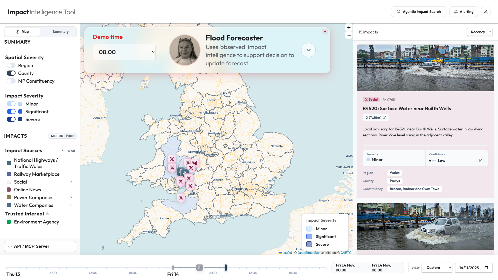
- Fills the centre column of the three-column layout
- Zoom controls positioned top-right
- Demo time preset panel overlaid top-left
- Severity legend overlaid bottom-right (hidden when no spatial mode active)
- Deep dive status card overlaid bottom-right when agentic search is active

#### Behaviour
- **Base tile layer**: CartoDB Voyager (`basemaps.cartocdn.com/rastertiles/voyager`)
- **Impact markers**: Each impact creates an `L.divIcon` marker with category-specific SVG icon inside a `.marker-inner` div classed with category and severity. Social media impacts use platform-specific icons (X/Bluesky/Threads). Marker icon size is 32x37px with anchor at bottom-centre.
- **Overlapping marker handling**: When multiple impacts share coordinates, a golden-angle spiral jitter (137.5°) is applied with a base separation of ~0.032° (~2km). Each subsequent marker at the same position spirals outward using `radius = distStep * sqrt(count)`.
- **Spatial overlays**: GeoJSON layers for regions, counties, and constituencies. Only one is active at a time (radio-button behaviour via sidebar checkboxes). Each polygon is filled based on the maximum severity of impacts within it: minor = #bfdbfe, significant = #2563eb, severe = #1e3a8a, all at 50% fill opacity. Polygons with no impacts are transparent.
- **Forecast layer**: Rendered in a custom `warnings` pane (z-index 450). Uses Chaikin's smoothing algorithm (2 iterations) for rounded polygon shapes. Outer zones are yellow (#FFFF00), inner/core zones are amber (#FFBF00). Fill opacity is 0.04 (very pale), stroke width is 9.5px, opacity 0.85. Click events pass through the fill to markers below (`pointerEvents: 'visibleStroke'`).
- **Fire & Rescue boundary**: South Wales Fire & Rescue outline in red (#dc2626), weight 4, opacity 0.9, no fill. Only shown when demo time preset is set to 08:30. Added to front of layer stack.

#### Inputs
- Impact data (filtered by time, category, severity, type)
- GeoJSON boundary files
- User interactions (click markers, click spatial polygons, pan/zoom)

#### Outputs
- Visual map with markers and overlays
- On marker click: `selectImpact(imp)` is called, highlighting the marker and scrolling to the corresponding feed card
- On spatial polygon click: `showSpatialSummaryModal(name, mode)` opens the spatial summary modal

#### Edge Cases
- When no impacts exist in the time window, no markers are rendered
- If a GeoJSON file fails to load, the error is caught and logged but the application continues
- Markers with null lat/lng are skipped

---

### 4.2 Impact Feed (Right Sidebar)

#### Description
A scrollable vertical feed of impact cards on the right side of the screen, showing all impacts matching the current filters.

#### UI Representation
- Located in a fixed-width right sidebar panel (`#side-feed-panel`)
- Header shows impact count and sort dropdown
- Each card has: optional photo, category tag with icon, timestamp, title, source link, evidence text, severity/confidence indicators, and location breakdown (region/county/constituency)
- Cards have a pastel tint background derived from the category colour with 8% opacity (hex suffix `14`)

#### Behaviour
- **Sorting**: Controlled by dropdown — Recency (newest first), Severity (severe > significant > minor, then by time), Type (alphabetical by category label, then by time)
- **Sort change**: When the sort dropdown changes, `feedCont.scrollTop = 0` resets the scroll position to the top
- **Card click**: Calls `selectImpact(imp)` which highlights the corresponding marker on the map and adds a `.card-flash` animation
- **Selected card**: Gets `.active` class for visual highlight
- **No-photo cards**: Cards without photos get `.no-photo` class, the photo div is hidden, and the card is sized appropriately without a gap
- **Photo error handling**: Each photo div contains a hidden `` element with an `onerror` handler that hides the photo div and adds `.no-photo` to the card if the image fails to load
- **Empty state**: Shows "No impacts in the selected range."

#### Card Content Structure
1. Photo area (optional) — background-image div
2. Category tag — coloured pill with icon and label (e.g., "National Highways / Traffic Wales")
3. Timestamp — e.g., "Fri 08:15"
4. Title — cleaned of any "[Source]" prefix for social impacts
5. Source link — external link with arrow icon
6. Evidence text — paragraph description
7. Severity/Confidence row:
   - Severity: coloured rectangle + label (Minor/Significant/Severe)
   - Confidence: three dots indicator + label + assessment button (document icon)
8. Location group:
   - Region chip
   - County chip(s) — may show multiple if impact polygon intersects multiple counties
   - Constituency chip(s) — same as counties

---

### 4.3 Left Sidebar (Filters & Controls)

#### Description
A fixed-width left sidebar containing all filter controls, view toggles, and navigation.

#### UI Representation
- Contains: Map/Summary view toggle, Spatial Severity section, Impact Severity filters, Impact Sources/Types selector, Forecast toggle, and API/MCP Server button at the bottom

#### 4.3.1 View Mode Toggle (Map / Summary)

Two buttons at the top toggle between Map view and Summary view. Map view shows the map + feed; Summary view shows an AI narrative + tabular breakdown.

#### 4.3.2 Spatial Severity Section

Three checkbox toggles that behave as radio buttons (only one active at a time):
- **Region** — Shows UK region boundaries with severity fill
- **County** — Shows county boundaries with severity fill (default: checked)
- **MP Constituency** — Shows Westminster constituency boundaries with severity fill

When one is checked, the others are unchecked. The corresponding GeoJSON layer is added to the map, and the severity legend appears.

#### 4.3.3 Impact Severity Filters

Three toggle rows with custom severity indicator dots:
- **Minor** — light blue indicator (#bfdbfe)
- **Significant** — medium blue indicator (#2563eb)
- **Severe** — dark blue indicator (#1e3a8a)

All are checked by default. Unchecking hides impacts of that severity from both map and feed.

#### 4.3.4 Impact Sources / Types Sub-selector

A two-button tab bar toggles between "Sources" and "Types" views:

**Sources view** (`#sidebar-sources-view`):
- Roads: "National Highways / Traffic Wales" — roads category colour indicator (#446b82)
- Railways: "Railway Marketplace" — railways colour (#5b61a1)
- Social: Expandable with sub-items for X (Twitter), Bluesky, Threads — social colour (#9d174d)
- News: "Online News" — news colour (#8a4e6b)
- Energy: "Power Companies" — Expandable with sub-items for National Grid, SSE, UK Power Networks — energy colour (#8a7d4e)
- Water: "Water Companies" — Expandable with sub-items for Thames Water, South West Water, Severn Trent Water — water colour (#4e6b8a)
- EA (Trusted Internal section with lock icon): "Environment Agency" — ea-help colour (#00a651)

Each source row has:
- Checkbox toggle
- Coloured category indicator
- Label text
- "Only" trigger — clicking "Only" deselects all other sources and selects only this one
- Expandable groups have a chevron collapse icon that rotates on toggle

The sub-menus for Social, Energy, and Water start collapsed (hidden) and expand on click.

**Types view** (`#sidebar-types-view`):
Dynamic content rendered by `renderTypeFilters()`:
- Roads — maps to roads category
- Rail — maps to railways category
- Homes and Businesses — maps to social, news, ea-help categories
- Energy — maps to energy category
- Utilities — maps to water category

Each type row shows a live count of matching impacts and has custom checkbox + "Only" trigger.

#### 4.3.5 Forecast Toggle

Single checkbox row: "Forecast Overlays" — toggles visibility of the forecast warning polygons on the map.

#### 4.3.6 API / MCP Server Button

Fixed at the bottom of the sidebar footer. Opens the MCP modal displaying the auto-generated MP Morning Brief.

---

### 4.4 Timeline Controller (Footer)

#### Description
A 48-hour dual-range slider with drag-to-pan window, tick marks, time labels, and preset controls.

#### UI Representation
- Full-width footer bar with frosted glass styling
- Dual-range slider spanning 48 hours (0 = 48 hours ago, 48 = now)
- Coloured range highlight between the two handles
- Grab handle with three vertical lines for dragging the entire window
- Timeline tick marks: major ticks at midnight (with day/date label), moderate ticks every 6 hours (with time label), minor ticks every hour (no label)

#### Behaviour
- **Right handle** (high): Adjusts the end of the time window. Cannot be dragged to within 0.5h of the left handle.
- **Left handle** (low): Adjusts the start of the time window. Cannot be dragged to within 0.5h of the right handle.
- **Grab handle** (centre): Drag to pan the entire window without changing its duration. Clamped to 0–48 range.
- **Time display badge**: Shows "StartDate, StartTime → EndDate, EndTime" format
- **View period dropdown**: Last 6h, Last 12h, Last 24h, Today, Yesterday. Selecting one snaps the window to that preset. Manual slider changes set it to "Custom".
- **Date picker**: An HTML date input that jumps the timeline to the start of the selected day.

#### Edge Cases
- If the selected date is more than 48 hours ago, an alert is shown and the picker reverts
- The date picker's max value is clamped to the FIXED_NOW date

---

### 4.5 Demo Time Preset Panel

#### Description
A glassmorphic overlay panel in the top-left of the map showing the current demo time step, associated persona card, and expandable benefits.

#### UI Representation
- Position: absolute, top-left of map container
- Glassmorphic background: `rgba(255,255,255,0.38)` with `backdrop-filter: blur(24px) saturate(200%)`
- Border: 1.5px solid `rgba(220,38,38,0.2)` with 18px border-radius
- Red-accented box-shadow
- Layout: Row with two columns — left side (label + dropdown) and right side (persona card)
- Minimize button (top-right): Toggles between full view and collapsed view showing only the label

#### Content
- **Demo time label**: "Demo time" in red (#dc2626), 1.09rem, weight 600
- **Time dropdown**: Select with options 08:00, 08:30, 08:45, 11:00, 14:00, 23:00
- **Persona card**: Shows persona photo (101px circle with red border), role title (1.52rem bold), and blurb text (1.27rem secondary colour)
- **Benefits toggle**: Green-bordered circular button (44px) with rotating chevron SVG
- **Benefits panel**: Expands below the persona with animated benefit items (green tick circles + text)

#### Persona Assignments

| Time  | Persona(s)                           | Key Blurb                                                                          |
|-------|--------------------------------------|-------------------------------------------------------------------------------------|
| 08:00 | Flood Forecaster                     | Uses 'observed' impact intelligence to support decision to update forecast          |
| 08:30 | Fire and Rescue Controller           | Uses forecast to make operational decisions on resources and equipment              |
| 08:45 | Parliamentary Assistant              | Agent uses intelligence to create morning brief for Monmouth MP                     |
| 11:00 | Flood Forecaster                     | Focusses agentic search in key risk areas                                           |
| 14:00 | All three (no benefits shown)        | Varying blurbs per persona                                                          |
| 23:00 | Flood Forecaster                     | Saves impact information to learn for future floods and develop new ML techniques   |

#### Benefits by Persona

- Flood Forecaster: "More accurate warnings incorporating situational intelligence", "Earlier warning, giving more time to take action"
- Fire and Rescue Controller: "Situational awareness insights drive better operational decisions", "Directly protects lives and livelihoods"
- Parliamentary Assistant: "MP better able to meet needs of constituents"

At the 14:00 time slot (which shows all three personas), benefits are not displayed.

#### Behaviour
- On time change: Window snaps to midnight–selected time, persona card re-renders, the panel pulses (scale animation), and any open benefits panels close
- Fire layer: Toggled on at 08:30, removed at all other times
- Collapse/expand: Toggle button switches between `−` and `□` icons

---

### 4.6 Guided Demo Intro Sequence

#### Description
A three-step click-through onboarding sequence that plays on first load, before the normal demo controls appear.

#### Step 0 — Intro Panel
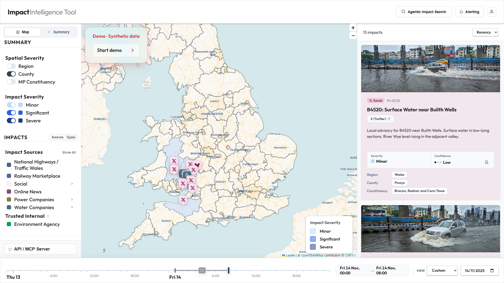
- The normal demo controls (dropdown, persona, benefits, minimize button) are hidden
- An intro panel is injected into the demo preset container with:
  - Badge: "Demo · Synthetic data" — styled to match `.demo-time-preset-label` (1.09rem, #dc2626)
  - Start button: "Start demo ▶" — glassmorphic button matching `.demo-time-preset select` styling
- Clicking "Start demo" fades out the intro and triggers Step 1

#### Step 1 — Map Highlight
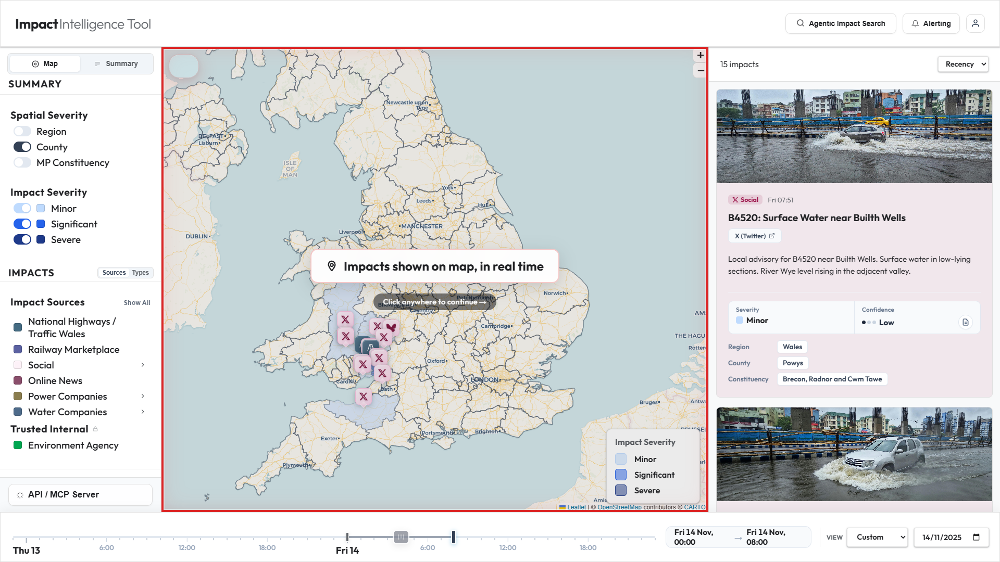
- A red-bordered overlay (`demo-step-overlay`) appears over the map container with:
  - Animated red inset border (3px solid rgba(220,38,38,0.6) with pulse keyframe)
  - Label: pin icon + "Impacts shown on map, in real time"
  - Hint: "Click anywhere to continue →"
- Clicking fades out the overlay and triggers Step 2

#### Step 2 — Impact Sources Highlight
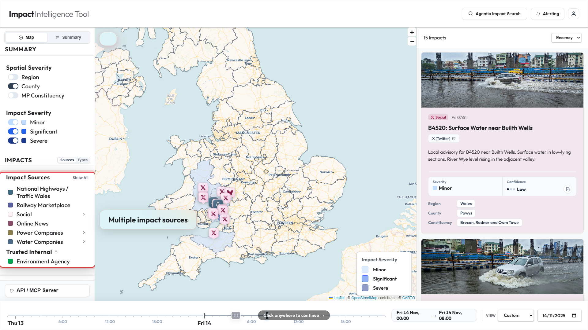
- A transparent full-screen click-catcher (`.demo-click-catcher`) is added (no dark dimming)
- The `#sidebar-sources-view` element gets `.demo-spotlight` class: red box-shadow glow, elevated z-index
- The sidebar-content parent is elevated to z-index 2001 so the spotlight appears above the click-catcher
- A glassmorphic label (`.demo-glass-label`) is positioned to the right of the sources view: "Multiple impact sources"
- Fixed-position hint: "Click anywhere to continue →"
- Clicking removes all overlays and triggers Step 3

#### Step 3 — LLM Pipeline + Somerset Marker
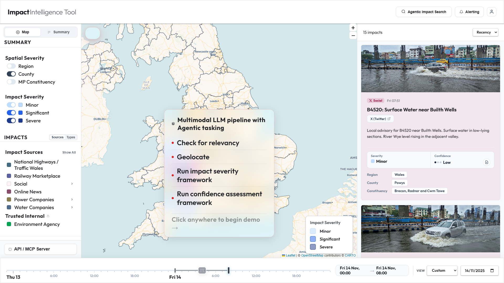
- A transparent click-catcher is added
- The Somerset marker (`ev-social-12`) is found via `State.markers.find(m => m.impactId === 'ev-social-12')` and highlighted with `.demo-marker-highlight` (scale 1.6, red drop-shadow)
- A glassmorphic pipeline panel (`.demo-pipeline-panel`) is positioned beneath the marker:
  - Title: "Multimodal LLM pipeline with Agentic tasking" (1.5rem, var(--text-primary), with layers SVG icon)
  - Four pipeline steps that animate in one by one (300ms + 360ms stagger):
    1. Check for relevancy
    2. Geolocate
    3. Run impact severity framework
    4. Run confidence assessment framework
  - Hint: "Click anywhere to begin demo →"
- An SVG dashed connector line (red, 2px, dash 6,4) is drawn from the marker to the top of the panel
- Clicking removes everything and calls `showNormalControls()` which restores the normal demo panel and triggers the 08:00 preset

#### CSS Classes for Demo Intro

- `.demo-intro-active` — Column layout for intro state
- `.demo-intro-badge` — Matches `.demo-time-preset-label` style
- `.demo-start-btn` — Matches `.demo-time-preset select` glassmorphic styling
- `.demo-step-overlay` — Full overlay with animated red inset border
- `.demo-click-catcher` — Full-screen transparent overlay (z-index 2000) for click capture without dimming
- `.demo-spotlight` — z-index 2001, red box-shadow glow
- `.demo-glass-label` — Glassmorphic label: rgba(255,255,255,0.38) bg, blur(24px) saturate(200%), 1.5rem font, red border
- `.demo-marker-highlight` — scale(1.6), red drop-shadow filter
- `.demo-pipeline-panel` — Glassmorphic panel: rgba(255,255,255,0.38) bg, same backdrop-filter as glass-label, 420px width
- `.pipeline-title` — 1.5rem, weight 700, var(--text-primary)
- `.pipeline-step` — 1.65rem, animated opacity/translateX, dark text when visible
- `.pipeline-dot` — 8px red circle indicator
- `.pipeline-click-hint` — 1.5rem, rgba(0,0,0,0.4) text

---

### 4.7 Assessment Justification Modal

#### Description
A modal that shows detailed severity and confidence analysis for an individual impact or a spatial aggregation.

#### UI Representation
- Full-screen semi-transparent overlay with centred modal card
- Header: Record box with category colour tint, category label, source name, clean title (stripped of "[Source]" prefix), and "View source ↗" link
- Body sections:
  - Severity/Confidence indicator row (matching feed card style with coloured rectangles and dot indicators)
  - Severity assessment section with synthesis text and framework link
  - Confidence & source reliability section with dynamic reliability note, confidence statement, and justification text
  - Timing section showing estimated start/end times

#### Source Reliability Notes (Dynamic)
Generated by `getSourceReliabilityNote(imp)`:
- Official agencies (EA, energy, water, railways): "Official agency source — data from verified government or utility systems carries high inherent reliability."
- X (Twitter): "X (Twitter) posts are unverified social signals, generally treated as low confidence. Confidence increases significantly when the post originates from a verified official account..."
- Bluesky: Similar to Twitter but for Bluesky platform
- Threads: Similar to Twitter but for Threads platform
- News: "Online news provides situational context but may lag official sources..."
- Roads: "Sourced from National Highways or Traffic Wales official systems — high reliability..."

---

### 4.8 Spatial Summary Modal

#### Description
A modal showing aggregated impact analysis for a clicked region, county, or constituency polygon.

#### UI Representation
- Two-column layout inside the modal
- Left sidebar: Active impact count (large number), severity badge, and "View Justification" button
- Main area: Overview prose, contributing intelligence source pills, and scrollable list of supporting evidence (mini cards with click-to-navigate)

#### Behaviour
- `showSpatialSummaryModal(areaName, mode)` filters all current impacts by area, calculates maximum severity, generates a summary assessment, and stores it in `State.spatialAssessments` for later retrieval by the assessment modal
- Clicking a mini evidence card closes the spatial modal and navigates to that impact on the map/feed

---

### 4.9 Agentic Search

#### Description
A simulated capability to deploy AI agents to investigate specific geographic areas for additional intelligence.

#### UI Representation
- Triggered by "Agentic Impact Search" button in the header
- Opens a configuration modal with:
  - Toggle: Forecast Driven / User Driven
  - User Driven mode: Interactive Leaflet map for drawing a search polygon by clicking points
  - Intelligence source modules: "Agentic Web Search" and "Review live video streams" (checkboxes)
  - Start/Cancel buttons

#### Behaviour
- **Forecast Driven**: Uses the active forecast region (no manual location input)
- **User Driven**: User clicks points on a mini-map to draw a polygon. Points are connected with polylines, and a closed polygon forms at 3+ points. Ghost line follows the cursor from the last point.
- **Start Search**: Creates a session, flashes the polygon on the main map with an "Enhanced search in this area" label (fades after 2s), and begins processing
- **Processing**: 7 predefined steps execute at 4.5-second intervals, updating a progress bar and status text overlay in the bottom-right of the map
- **Steps**: "Starting check...", "Checking local sensor data", "Getting status of roads and power", "Looking for new reports on social media", "Matching reports from different sources", "Confirmed issues. Saving summary.", "Search complete. Data updated."

---

### 4.10 Agentic Alerting

#### Description
A system for configuring automated monitoring rules with natural-language input and AI interpretation.

#### UI Representation
- Accessed via "Alerting" button in header or the "Agentic Alerting" tab in the Config modal
- Contains:
  - Natural language textarea with pre-populated example
  - "Configure with AI" button that simulates NL parsing
  - Advanced fine-tune controls (collapsible):
    - Severity threshold selector (Minor/Significant/Severe)
    - AI clustering mode checkbox
    - Multi-area picker with county/region dropdown and chip display
    - Sector filter buttons
    - Notification channel buttons (Browser/Teams/SMS/Email/Phone)
  - Active alerts list
  - Recent triggers history

#### Behaviour
- **AI Configuration**: Two-phase simulated processing (1s "Interpreting..." + 0.8s "Configuring...") then `parseAlertNL()` runs regex-based extraction of severity, areas, categories, and channels from the natural language text
- **AI Clustering Mode**: When enabled, alerts trigger when any county has 3+ impacts or 1+ severe impact, regardless of individual severity thresholds
- **Alert Evaluation**: Runs on every time window change. Checks all active alerts against current impacts, fires browser notifications for new matches, records in history
- **Persistence**: Alerts are saved to localStorage under key "impact-alerts"
- **Channels**: Only browser notifications are functional (other channels are UI-only)

---

### 4.11 Summary View

#### Description
An alternative to the map view showing an AI-generated prose narrative and tabular breakdown of impacts.

#### UI Representation
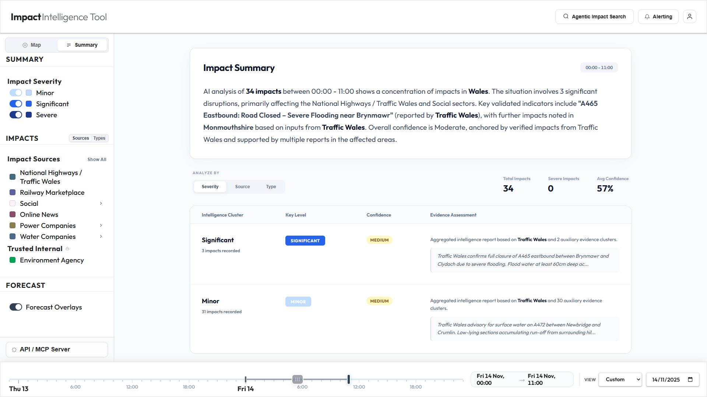
- Replaces the map and feed panels
- Contains:
  - Impact Summary card with time reference and AI-generated prose
  - Controls: Analyze By Severity/Source/Type buttons
  - Stats banner: Total Impacts, Severe Impacts, Avg Confidence
  - National Impact Table with columns: Intelligence Cluster, Key Level, Confidence, Evidence Assessment

#### Behaviour
- **Narrative generation**: `generateNarrativeSummary()` produces an HTML paragraph identifying the most impacted region, highlighting severe/significant incidents, and quoting specific impact titles and sources
- **Table grouping**: Groups impacts by the selected dimension (severity/source/type), calculates max severity and average confidence per group, and renders rows with severity pills and confidence badges

---

### 4.12 MCP Server Modal

#### Description
Displays a pre-configured "MP Morning Brief" generated at 08:00 by the Parliamentary Assistant agent via the Impacts MCP server.

#### UI Representation
- Badge: "Auto-generated · 08:00"
- Title: "MP Morning Brief"
- Subtitle: "Information obtained via Impacts MCP"
- Three bullet points with category-specific icons:
  1. Social icon: "Surface water flooding reported on constituency approach roads."
  2. Roads icon: "A40 closed in neighbouring county — severe flooding causing road disruption."
  3. EA icon: "EA Flood Guidance Statement suggests potential for flooding impacts on local rivers throughout the day."

---

### 4.13 Config Modal

#### Description
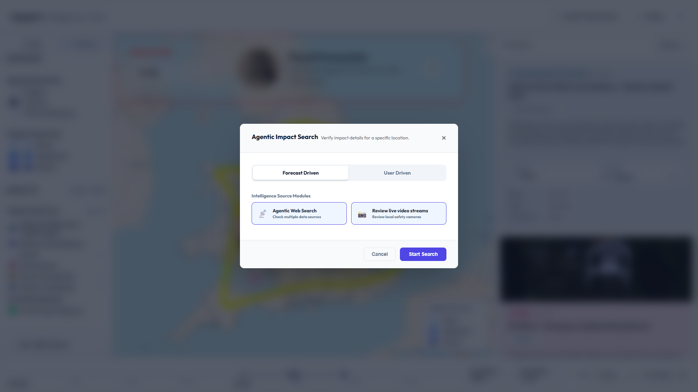
System configuration modal with three tabs.

#### Tabs

**Agentic Maintenance**:
- Daily Validator Workflow status (online dot, "Last run: Today, 07:15 AM")
- Trusted Twitter Sources list: BBC News, TfL, National Highways, Met Office, Environment Agency (all marked "Official")
- Recent Workflow Activity changelog (12 Mar: Added EnvAgencyNorth, 10 Mar: Verified 142 handles)

**Agentic Alerting**: See Feature 4.10

**Impact Framework**:
- Severity Matrix tables for four dimensions:
  1. Life & Safety: Danger to Life count — Minor: 40, Significant: 200, Severe: 300
  2. Built Environment: Residential count — 5/30/100; Non-residential — 1/10/30
  3. Critical Infrastructure: Key sites denial — 0/1/2; Infrastructure denial — 1/2/4
  4. Transport: Trunk roads (m) — 150/500/1800; Other major roads (m) — 500/1800/-; Railways (m) — 300/950/-

---

## 5. UI/UX Behaviour Specification

### 5.1 Global Layout

The page uses a fixed full-viewport layout with:

1. **Header** (80px height): Logo, navigation buttons, user profile dropdown
2. **Workspace** (flex-grow): Three-column layout:
   - Left sidebar (~280px): Filters and controls
   - Main area (flex-grow): Map or Summary view
   - Right sidebar (~380px): Impact feed
3. **Footer** (~80px): Timeline controller

Body has `overflow: hidden` — there is no page scroll. Individual panels scroll internally.

### 5.2 Z-Index Layering

| Layer | Z-Index | Description |
|-------|---------|-------------|
| Base tiles | (default) | Map tiles |
| Forecast polygons | 450 | Warning area overlays |
| Spatial overlays | (default) | Region/county fills |
| Impact markers | 600 | Map markers (Leaflet default markerPane) |
| Severity legend | 1000 | Bottom-right map legend |
| Demo preset panel | 1000 | Top-left map overlay |
| Deep dive status | 1200 | Search progress overlay |
| Demo click-catcher | 2000 | Transparent interaction blocker |
| Demo spotlight | 2001 | Elevated highlighted element |
| Demo connector SVG | 2002 | Dashed line from marker to pipeline |
| Demo labels/panels | 2003 | Glass labels and pipeline panel |
| Modals | 2100 | All modal overlays |

### 5.3 Interaction Model

- **Click**: Primary interaction — selects impacts, opens modals, toggles filters, advances demo steps
- **Hover**: Subtle — button background changes, border colour shifts, slight translateY(-1px) lifts
- **Drag**: Timeline grab handle for panning the time window
- **Toggle**: Checkboxes for filters, radio-like behaviour for spatial mode
- **Expandable sections**: Social/Energy/Water sub-menus toggle visibility with rotating chevron icons

### 5.4 Visual Language

#### Colour Rules

**Category colours** (de-saturated professional palette):
- Roads: #446b82 (slate blue)
- Railways: #5b61a1 (lavender)
- Social: #9d174d (deep pink)
- News: #8a4e6b (muted rose)
- Energy: #8a7d4e (olive gold)
- Water: #4e6b8a (steel blue)
- EA Help: #00a651 (EA green)

**Severity colours** (blue ramp for high contrast):
- Minor: #bfdbfe (light blue)
- Significant: #2563eb (medium blue)
- Severe: #1e3a8a (dark navy)

**Confidence indicators** (three-dot system):
- High: 3 filled dots, green text (#166534)
- Medium: 2 filled + 1 empty dot, amber text (#854d0e)
- Low: 1 filled + 2 empty dots, red text (#991b1b)

**Demo accent**: #dc2626 (red) used for all demo overlay elements, borders, labels, and connector lines

#### Typography
- Font: Outfit (Google Fonts), all weights 300–700
- H1 (logo): 1.5rem weight 700, "Intelligence Tool" portion weight 300 in secondary colour
- Body: var(--text-primary) = #202124
- Secondary text: var(--text-secondary) = #5f6368

#### Animations
- `demo-fade-in`: Opacity 0→1, translateY(8px→0)
- `demo-preset-pulse`: Double scale pulse (1→1.04→1→1.04→1) with red box-shadow rings
- `benefitSlideIn`: Opacity 0→1, translateY(10px→0) with 0.3s stagger per item
- `livePulseAni`: Scale 0.9→1.1→0.9 with green glow for agentic search indicator
- `slideDown`: Opacity 0→1, translateY(-10px→0) for dropdown menus
- Pipeline steps: Opacity 0→1, translateX(-10px→0) with 360ms stagger

---

## 6. Map Behaviour

### 6.1 Layer Stacking Order (bottom to top)

1. CartoDB Voyager base tiles
2. Forecast warning polygons (pane z-index 450)
3. Region/County/Constituency spatial overlays (default overlay pane)
4. Fire & Rescue boundary (overlay pane, brought to front)
5. Outage polygons (dashed, category-coloured)
6. Impact markers (marker pane, z-index 600)
7. Demo overlays (z-index 2000+)

### 6.2 Layer Toggle Behaviour

- **Spatial overlays**: Radio-button — checking one unchecks others. Layer is removed from map on uncheck, added on check.
- **Fire layer**: Programmatic only — appears/disappears based on demo time preset (08:30 only)
- **Forecast**: Toggle checkbox in sidebar — controls `State.showForecast` boolean

### 6.3 Marker Click Behaviour

Clicking a marker:
1. Calls `selectImpact(imp)`
2. The clicked marker gets `.marker-highlight` class and its inner element scales to 1.15x
3. All other markers lose their highlight
4. The corresponding feed card scrolls into view and flashes (`.card-flash` animation for 600ms)
5. Any selected outage polygon gets increased fill opacity (0.55) and weight (4)

### 6.4 Spatial Polygon Click Behaviour

Clicking a region/county/constituency polygon:
1. Map zooms to fit the polygon bounds with 100px padding and max zoom 8
2. `showSpatialSummaryModal(areaName, spatialMode)` opens with aggregated analysis

---

## 7. Impact System

### 7.1 Impact Definition

An "impact" is any discrete event or observation that indicates disruption to infrastructure, services, or safety. Impacts come from seven source categories and are classified into five types based on what sector they affect (not where the data came from).

### 7.2 Severity Classification

Three levels forming a blue ramp:
- **Minor** (#bfdbfe): Localised disruption, limited infrastructure strain
- **Significant** (#2563eb): Widespread regional disruption, moderate pressure
- **Severe** (#1e3a8a): Major structural failures, critical system-wide impact

Severity is pre-assigned in the data files and cross-referenced against the Impact Framework quantitative thresholds.

### 7.3 Type Inference

The function `getImpactType(imp)` determines what sector an impact affects:
1. If `imp.impactType` is explicitly set, use it
2. Direct category mappings: roads→roads, railways→rail, energy→energy, water→utilities, ea-help→housing
3. For social/news: Regex-based text analysis of title + evidence to detect road names (M4, A40...), rail terms, power terms, water terms
4. Default fallback: "housing" (community/residential flood impacts)

### 7.4 Geographic Linkage

Each impact has lat/lng coordinates. During loading:
1. Point-in-polygon tests are run against all three boundary GeoJSONs (regions, counties, constituencies)
2. The `locationName` field is set to "Region | County | Constituency"
3. For impacts with outage polygons, `findIntersectingFeatures()` identifies all overlapping counties/constituencies

### 7.5 Impact Card Specification

#### Layout
- Full-width within the feed sidebar
- Optional photo area at top (background-image, cover, 180px height default)
- Body with consistent padding
- Stats grid at bottom

#### Content Hierarchy (top to bottom)
1. Photo (if available)
2. Category tag + Timestamp (inline row)
3. Title (h4, bold)
4. Source link (external link with arrow)
5. Evidence text (paragraph)
6. Severity + Confidence indicators (inline stat row)
7. Location breakdown (Region → County → Constituency)

#### Dynamic Behaviour
- Background tint: 8% opacity of category colour (hex + "14" suffix)
- Photo fallback: Hidden `` with onerror handler
- Assessment button: Opens assessment justification modal
- Entire card is clickable — selects the impact

---

## 8. User Flows

### 8.1 Opening the Application

1. Browser loads `index.html`
2. CSS and Leaflet are loaded from CDN
3. On `window.load`, `init()` fires
4. GeoJSON boundaries and impact data are fetched in parallel
5. The map renders with CartoDB Voyager tiles, centred on UK
6. County boundaries are added to the map (default spatial mode)
7. Impact markers appear on the map
8. The feed populates with impact cards sorted by recency
9. The timeline shows midnight–08:00 on Friday 14th November
10. The demo intro panel appears: "Demo · Synthetic data" + "Start demo" button
11. Normal demo controls (time dropdown, persona card) are hidden behind the intro

### 8.2 Demo Intro Walkthrough

1. User clicks "Start demo"
2. Intro fades out → Step 1: Red border appears on map with "Impacts shown on map, in real time"
3. User clicks → Step 2: Impact Sources section in sidebar glows red, glassmorphic label "Multiple impact sources" appears to its right
4. User clicks → Step 3: Somerset Twitter marker scales up and glows, dashed red line connects it to a glassmorphic "Multimodal LLM pipeline with Agentic tasking" panel below, showing four steps animating in
5. User clicks → Normal demo controls appear, time is set to 08:00, Flood Forecaster persona shown

### 8.3 Exploring a Demo Time Step

1. User selects "08:30" from the time dropdown
2. Timeline window snaps to midnight–08:30
3. Feed re-renders with impacts up to that time
4. Fire and Rescue Controller persona appears with blurb
5. South Wales Fire & Rescue red boundary appears on map
6. User clicks the green benefits arrow → benefits animate in: "Situational awareness..." and "Directly protects lives..."
7. Demo preset panel pulses briefly to signal the change

### 8.4 Investigating an Impact

1. User clicks a marker on the map
2. Marker highlights (scales to 1.15x)
3. Feed scrolls to corresponding card, which flashes
4. User reads the card details
5. User clicks the assessment button (document icon next to confidence)
6. Assessment modal opens showing severity assessment, confidence analysis, source reliability note, and timing estimates
7. User can click "Impact Framework" link to open the Config modal on the framework tab

### 8.5 Using Spatial Summary

1. User ensures a spatial overlay is active (e.g., County)
2. User clicks a county polygon on the map
3. Map zooms to fit that county
4. Spatial Summary modal opens showing: impact count, max severity, overview prose, contributing intelligence sources, and list of supporting evidence
5. User can click any evidence item to navigate to that specific impact

---

## 9. Error Handling & Resilience

### 9.1 Missing Data Files
- Impact data files: If any single source file fails to fetch (returns non-OK), it returns an empty array. The application continues with data from other sources.
- Forecast data: A separate try/catch fetches `warning_cords.json`. On failure, a hardcoded fallback FeatureCollection with two simple polygons is used.
- GeoJSON boundaries: Errors are caught and logged. The application continues without the failed layer.

### 9.2 Missing Photos
- Each photo card includes a hidden `` element with an `onerror` handler
- On error: The photo div's display is set to none, the card gets `.no-photo` class
- The card layout adjusts seamlessly — no gap is left

### 9.3 Empty Datasets
- Feed shows: "No impacts in the selected range."
- Summary narrative shows: "No significant impacts detected for the selected period across configured categories."
- Spatial overlays show transparent fills (no severity colouring)
- Stats show zeros

### 9.4 UI Fallback States
- If marker element is null when trying to highlight, the code safely checks with `if (markerEl)`
- If the Somerset marker for the demo intro is not found, the pipeline panel falls back to map centre positioning
- Alert loading from localStorage is wrapped in try/catch — corrupted data results in empty alert list

---

## 10. Performance Considerations

### 10.1 Data Size
- The application loads all data upfront during initialisation
- Impact thinning: Energy and water impacts are capped at 1 each; non-severe impacts are thinned by 15% using deterministic hashing
- GeoJSON files can be large (uk-counties.geojson is ~266k tokens) — they are loaded once and cached in `State.raw*` properties

### 10.2 Rendering
- Markers and polygons are cleared and re-created on every filter change (`renderImpacts()`)
- Spatial summary overlay colouring uses a two-pass approach: first builds an index from impact metadata (fast), then falls back to point-in-polygon tests only for unmatched features (slower but necessary)
- Chaikin smoothing on forecast polygons runs on data load, not on every render

### 10.3 Event Handling
- Timeline drag uses mousemove/mouseup on `window` — frequent updates during drag
- Feed re-renders are full innerHTML replacements, which could be expensive with many impacts but is acceptable for the ~30-40 impacts in the dataset
- All event listeners use standard DOM APIs — no virtual DOM or diffing

---

## 11. Responsive Breakpoints

The CSS defines six responsive breakpoints that progressively scale down all UI elements:

1. **≥1800px**: Largest screens — 20%+ bigger sidebar fonts, generous demo panel, larger feed cards
2. **~1600px** (`max-width: 1750px`): Slightly reduced sizes
3. **~1400px** (`max-width: 1480px`): Medium reduction
4. **~1200px** (`max-width: 1280px`): Further reduction for standard laptops
5. **~1024px** (`max-width: 1100px`): Tablet/small laptop sizes
6. **Smallest** (`max-width: 900px` or similar): Most compact layout

Each breakpoint adjusts: demo panel padding/gap/min-width, persona photo size, role/blurb font sizes, benefits text size, sidebar font sizes, feed card dimensions, and timeline label sizes.

---

## 12. Appendix A: Asset Manifest

### GeoJSON Files
- `frontend/geo/uk-regions.geojson`
- `frontend/geo/uk-counties.geojson`
- `frontend/geo/westminister.json`
- `frontend/geo/uk-fire.json`
- `frontend/geo/uk-roads.geojson`
- `frontend/geo/4534.json`

### Data Files
- `frontend/data/roads.json`
- `frontend/data/railways.json`
- `frontend/data/social.json`
- `frontend/data/news.json`
- `frontend/data/energy.json`
- `frontend/data/water.json`
- `frontend/data/ea-help.json`
- `frontend/data/warning_cords.json`

### Persona Photos
- `frontend/photos/Flood_forecaster.jpg`
- `frontend/photos/Fire_rescue_controller.jpg`
- `frontend/photos/MP_assistant.jpg`

### Event Photos
- `frontend/photos/Monmouth.jpg`
- `frontend/photos/Monmouth 2.png`

### Stock Photos (Pexels)
- `frontend/photos/pexels-connorscottmcmanus-13865772.jpg`
- `frontend/photos/pexels-dibakar-roy-2432543-26202087.jpg`
- `frontend/photos/pexels-dibakar-roy-2432543-26202093.jpg`
- `frontend/photos/pexels-juan-moccagatta-2159466094-36288963.jpg`
- `frontend/photos/pexels-juan-moccagatta-2159466094-36304326.jpg`
- `frontend/photos/pexels-kelly-19063417.jpg`
- `frontend/photos/pexels-kent-spencer-mendez-52733750-9137104.jpg`
- `frontend/photos/pexels-markus-winkler-1430818-3532526.jpg`
- `frontend/photos/pexels-sveta-k-75705601-8568719.jpg`
- `frontend/photos/pexels-tomfisk-6226996.jpg`
- `frontend/photos/pexels-valentin-ivantsov-2154772556-35249003.jpg`

### Logos
- `frontend/assets/logos/EnvAgency.png`
- `frontend/assets/logos/National_Rail_logo.svg.png`
- `frontend/assets/logos/Threads_(app)_logo.svg`

### Other Assets
- `frontend/favicon.svg`
- `frontend/assets/images/qr-code.png`

### Application Files
- `frontend/index.html`
- `frontend/app.js`
- `frontend/style.css`

---

## 13. Appendix B: Import Inventory

### External Libraries (CDN)
- Leaflet.js v1.9.4 (CSS + JS from unpkg.com)

### External Fonts (CDN)
- Google Fonts: Outfit (weights 300, 400, 500, 600, 700)

### External Tile Providers
- CartoDB Voyager (basemaps.cartocdn.com/rastertiles/voyager)

### Browser APIs Used
- Fetch API (for data loading)
- localStorage (for alert persistence)
- Notification API (for browser alerts)
- Date, Math, Map, Set (standard built-ins)
- DOM APIs (querySelector, addEventListener, createElement, etc.)

### No Framework Dependencies
The application uses zero JavaScript frameworks or libraries beyond Leaflet.js. All UI rendering, state management, event handling, and data processing are implemented with vanilla JavaScript.

---

## 14. Appendix C: Screenshot Specification

### Screenshot 1: Full System View — 08:00 Demo Time

#### Purpose
Shows the complete application layout at the primary demo starting point.

#### Required Contents
- Header with "Impact Intelligence Tool" logo, Agentic Search button, Alerting button, user profile
- Left sidebar with all filters visible (County spatial mode checked)
- Map showing UK with impact markers and county severity fills
- Demo preset panel showing 08:00 selected, Flood Forecaster persona
- Right sidebar with impact feed cards (sorted by recency)
- Timeline footer showing midnight–08:00 window
- Severity legend visible in bottom-right of map

#### UI State
- County spatial overlay: ON
- All categories: ON
- All severities: ON
- Forecast: OFF
- Demo time: 08:00

---

### Screenshot 2: Demo Intro — Start Screen

#### Purpose
Shows the initial onboarding state before the demo sequence begins.

#### Required Contents
- Demo preset panel with "Demo · Synthetic data" badge and "Start demo ▶" button
- Normal controls (dropdown, persona) should NOT be visible
- Map visible behind with markers

#### UI State
- Demo intro active
- No persona card visible

---

### Screenshot 3: Demo Intro — Step 2 (Impact Sources)

#### Purpose
Shows the Impact Sources highlight with glassmorphic label.

#### Required Contents
- Left sidebar with Impact Sources section highlighted (red glow border)
- Glassmorphic "Multiple impact sources" label positioned to the right of the sources section
- "Click anywhere to continue →" hint visible
- No screen dimming (transparent click-catcher, not dark overlay)

---

### Screenshot 4: Demo Intro — Step 3 (LLM Pipeline)

#### Purpose
Shows the Somerset marker highlighted with the pipeline panel beneath it.

#### Required Contents
- Somerset marker scaled up with red glow
- Dashed red connector line from marker to pipeline panel
- Glassmorphic pipeline panel showing "Multimodal LLM pipeline with Agentic tasking"
- All four pipeline steps visible (animated in)
- "Click anywhere to begin demo →" hint

---

### Screenshot 5: 08:30 — Fire & Rescue Controller

#### Purpose
Shows the Fire and Rescue Controller persona with the South Wales Fire boundary on the map.

#### Required Contents
- Demo preset showing 08:30
- Fire and Rescue Controller persona card with photo, role, and blurb
- Red South Wales Fire & Rescue boundary visible on the map
- Benefits toggle arrow visible but not expanded

---

### Screenshot 6: 08:30 — Benefits Expanded

#### Purpose
Shows the expanded benefits panel for the Fire and Rescue Controller.

#### Required Contents
- Benefits panel open beneath the persona card
- Two benefit items with green tick circles:
  - "Situational awareness insights drive better operational decisions"
  - "Directly protects lives and livelihoods"
- Benefits toggle button in open state (rotated arrow, green tint)

---

### Screenshot 7: Impact Card — Full Detail

#### Purpose
Shows a complete impact card in the feed with all elements visible.

#### Required Contents
- Photo area (if applicable) or no-photo variant
- Category tag with icon (e.g., "National Highways / Traffic Wales" in slate blue)
- Timestamp
- Title text
- Source link with external arrow
- Evidence paragraph text
- Severity rectangle (e.g., "Severe" in dark blue) + Confidence dots (e.g., "High" 3 dots)
- Location breakdown showing Region, County, and Constituency chips
- Pastel category tint background visible

---

### Screenshot 8: Impact Card — No Photo Variant

#### Purpose
Shows a card without a photo to verify no gap is left.

#### Required Contents
- Card with `.no-photo` class
- No photo area visible
- Card body starts immediately at top

---

### Screenshot 9: Assessment Modal

#### Purpose
Shows the full assessment justification modal for an impact.

#### Required Contents
- Record header box with category tint, source name, title, and "View source ↗" link
- Severity and Confidence indicators (matching card style)
- Severity assessment section with synthesis text and framework link
- Confidence section with source reliability note
- Timing section with estimated start/end

---

### Screenshot 10: Spatial Summary Modal

#### Purpose
Shows the aggregated spatial summary when clicking a county polygon.

#### Required Contents
- County name as title
- Impact count and severity badge in left sidebar
- Overview prose in main area
- Contributing intelligence source pills
- Supporting evidence list with mini cards

---

### Screenshot 11: Summary View

#### Purpose
Shows the alternative summary/narrative view.

#### Required Contents
- AI-generated prose paragraph
- "Analyze By" controls (Severity/Source/Type)
- Stats banner (Total, Severe, Avg Confidence)
- National Impact Table with cluster rows
- Left sidebar visible but without map

---

### Screenshot 12: Agentic Search Modal

#### Purpose
Shows the agentic search configuration interface.

#### Required Contents
- "Forecast Driven / User Driven" toggle
- Intelligence source module cards (Agentic Web Search, Review live video streams)
- Start Search / Cancel buttons

---

### Screenshot 13: Config Modal — Impact Framework Tab

#### Purpose
Shows the severity matrix thresholds.

#### Required Contents
- Four framework sections: Life & Safety, Built Environment, Critical Infrastructure, Transport Connectivity
- Tables showing Minor/Significant/Severe thresholds
- All four sections visible with their emoji icons

---

### Screenshot 14: Forecast Overlay Active

#### Purpose
Shows the forecast warning polygons on the map.

#### Required Contents
- Yellow/amber smoothed polygons visible on the map
- Nested zones (outer yellow, inner amber) clearly distinguishable
- Impact markers visible through the semi-transparent fill
- Forecast checkbox checked in left sidebar

---

### Screenshot 15: MCP Server Modal

#### Purpose
Shows the auto-generated MP Morning Brief.

#### Required Contents
- Badge: "Auto-generated · 08:00"
- Title: "MP Morning Brief"
- Three bullet points with category-specific icons
- Brief intro text

---

### Screenshot 16: Alerting Configuration

#### Purpose
Shows the agentic alerting interface with a configured alert.

#### Required Contents
- Natural language textarea with example text
- "Configure with AI" button
- AI interpretation summary (if shown)
- Fine-tune controls expanded
- At least one active alert in the list

---

### Screenshot 17: All Severities on Map

#### Purpose
Shows map with all three severity levels visible in spatial overlay.

#### Required Contents
- County overlay active
- At least one county showing minor (light blue), one significant (medium blue), one severe (dark blue)
- Severity legend visible showing all three levels

---

### Screenshot 18: Timeline Dragged to Yesterday

#### Purpose
Shows the timeline with the window dragged to a different position.

#### Required Contents
- Range highlight moved to left portion of timeline
- Time display showing previous day's date and times
- View period dropdown showing "Yesterday" or "Custom"
- Different set of impacts visible (fewer, as window covers yesterday)

---

---

## 15. Appendix D: Visual Inventory (20 Screenshots)

To provide a comprehensive overview of the system flow and features, the following 20 screenshots have been captured.

#### 15.1 Demo Intro Flow
1. **Intro Screen (Step 0):** 
2. **Map Highlight (Step 1):** 
3. **Sources Highlight (Step 2):** 
4. **LLM Pipeline (Step 3):** 

#### 15.2 Main Application & Personas
5. **Main View (08:00):** 
6. **Fire Controller (08:30):** 
7. **Benefits Panel:** 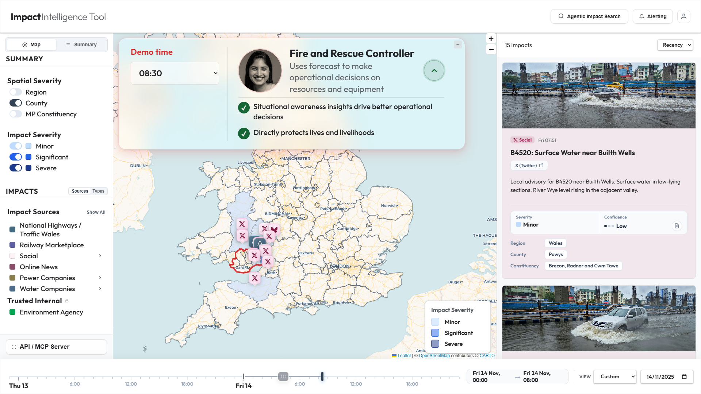
8. **Forecaster Search (11:00):** 

#### 15.3 Impact & Analysis Detail
9. **Impact Feed Sidebar:** 
10. **Impact Selection:** 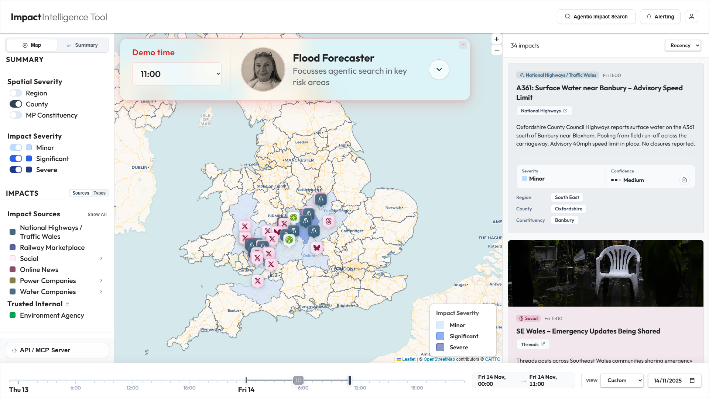
11. **Assessment Modal:** 
12. **Forecast Polygons:** 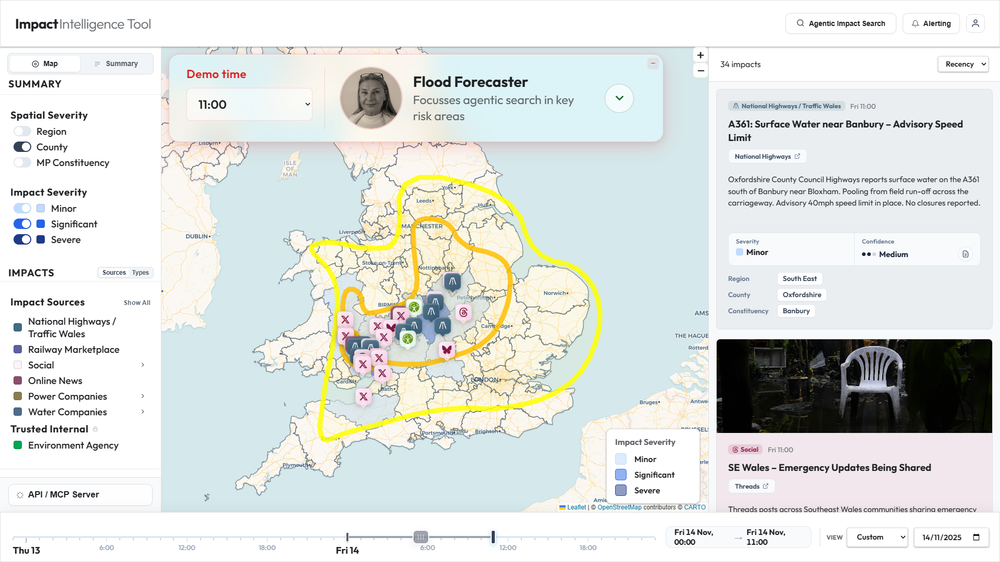
13. **Narrative Summary View:** 

#### 15.4 Agentic Config & Discovery
14. **Agentic Search Config:** 
15. **Alerting Config:** 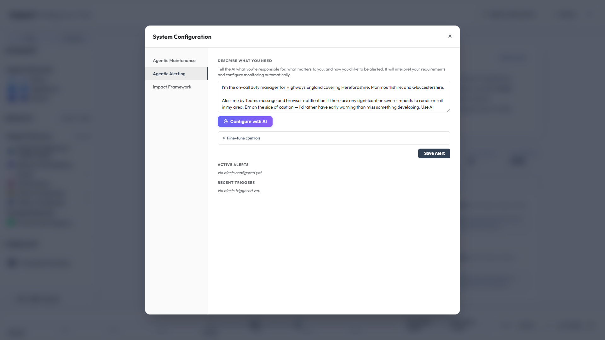
16. **Severity Framework:** 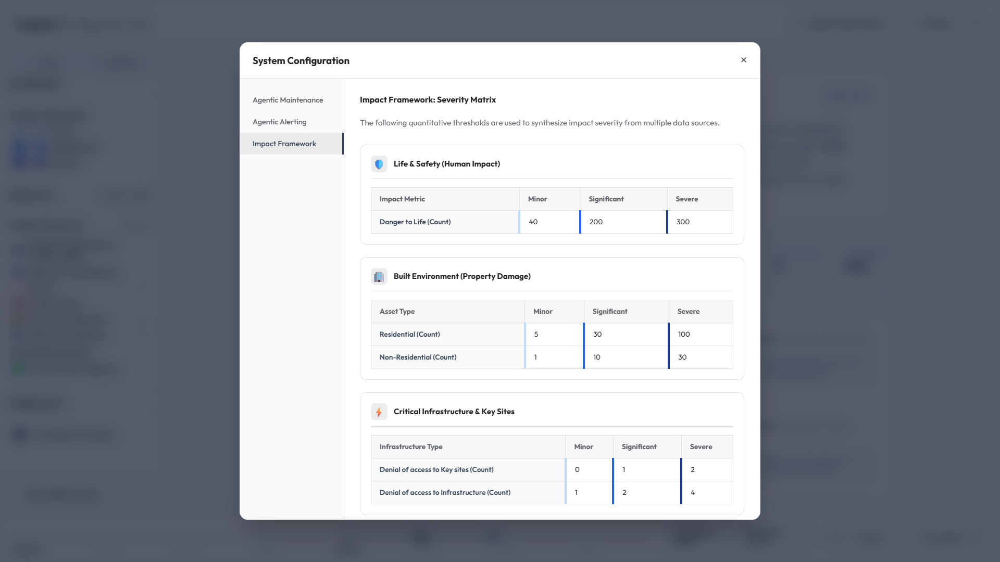
17. **Morning Brief (MCP):** 

#### 15.5 Spatial & Temporal Exploration
18. **Constituency Overlay:** 
19. **Spatial Analysis Modal:** 
20. **Temporal Navigation (Yesterday):** 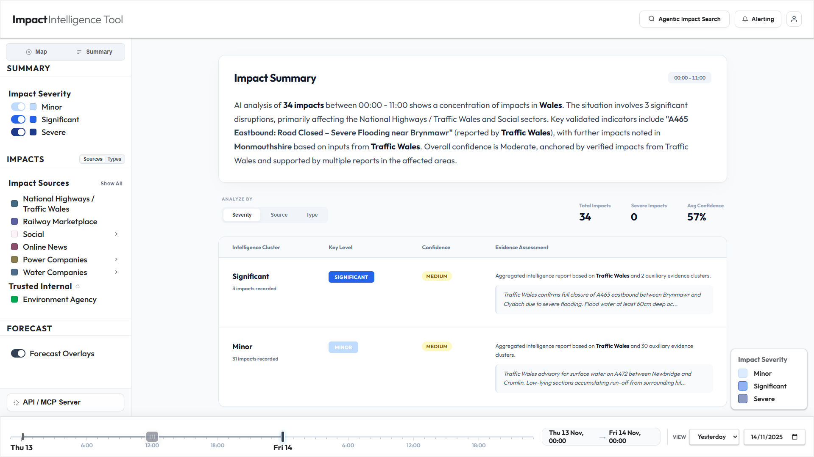

*End of PRD++ Document*

